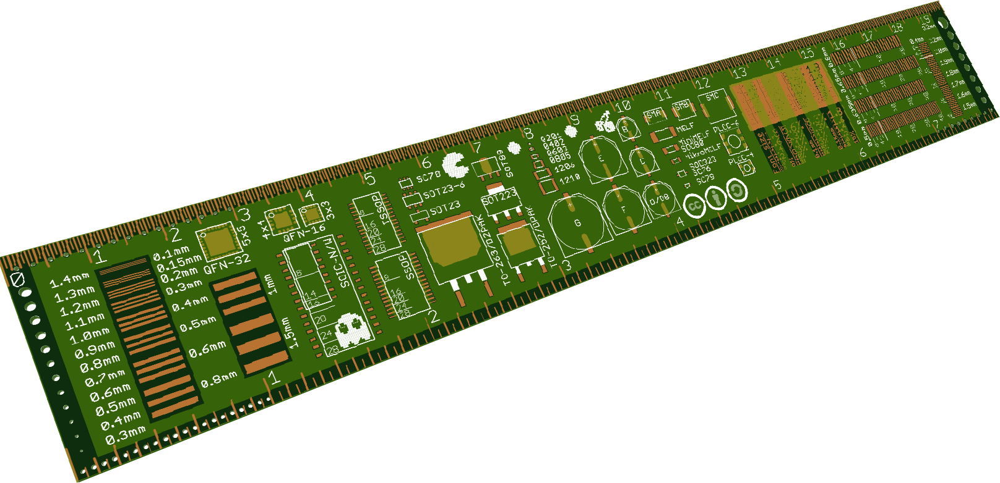

µcruler
=======

inspired by dave jone's [µruler](http://www.eevblog.com/projects/uruler/) and adafruit's [PCB ruler](http://www.adafruit.com/products/1554)

### Preview
This is what it will look like, may be slightly outdated. Click for full size version.

For the current version, but with some problems regarding stop layer and copper order, see [front](ucruler_top.png) and  [back](ucruler_bot.png).

## Footprints

In contrast to many other projects, I re-created the footprints from their datasheets. Therefore, they don't represent the needed size for soldering on your PCB, but the is-size of the package.

## Tables

All tables on the backside were created with the best knowledge I had, although I can't guarantee they are always 100% perfect and without any errors.

Especially the PCB trace thickness depends on so many factors that there can't be an universal rule. The values should match normal applications with some safety margin, but if you really need calculations exactly I recommend the [Saturn PCB Toolkit](http://www.saturnpcb.com/pcb_toolkit.htm).

## License

[Creative Commons Attribution-ShareAlike 3.0 Unported (CC BY-SA 3.0)](https://creativecommons.org/licenses/by-sa/3.0/)

In case you want to use data from this project, but can't fulfill the licence's requirements, please [contact me](http://moritz.augsburger.name/pages/imprint.html).
